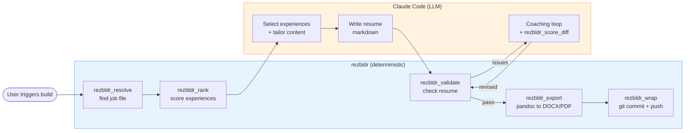

# rezbldr

A Go MCP server that moves deterministic work out of LLM prompts and into
testable, local code — purpose-built for AI-driven resume pipelines.

## The Problem

Large language models are remarkable writers, but they make expensive
calculators. When you use an LLM to build tailored resumes, the model ends up
doing tag-intersection scoring, file path lookups, word-count validation, and
document export. Every one of these tasks has an exact correct answer. Every
token the model spends on arithmetic is a token it is not spending on writing.

The reliability problem is worse than the cost. An LLM might score a skill
match at 0.85 one run and 0.72 the next, with identical inputs. It might
hallucinate a file path or skip a validation check when context gets long.
These are not edge cases — they are the predictable failure modes of asking a
stochastic system to do deterministic work.

And none of it is testable. When scoring logic lives inside a prompt, you
cannot write a unit test for it. You cannot measure coverage. You cannot
reproduce a bug. You just re-run the conversation and hope.

## The Approach

rezbldr is an [MCP](https://modelcontextprotocol.io/) server that keeps the
LLM as the orchestrator while offloading computation to conventional code. The
LLM decides *what* to write and how to tailor content for a specific role.
rezbldr handles *how* to find files, score experience relevance, validate
output, and export documents. MCP (Model Context Protocol) is Anthropic's open
standard for connecting AI models to external tools over a structured JSON-RPC
interface.

## Results

- **7 MCP tools** replacing ~1,000 lines of prompt logic
- **167 tests** with 82-99% coverage across packages
- **35% reduction** in skill prompt size
- **Stateless** stdio transport, zero external services, no database

## Quick Start

```
go install github.com/suykerbuyk/rezbldr/cmd/rezbldr@latest
rezbldr install
rezbldr check
```

- `go install` builds the binary and places it in your `$GOPATH/bin`.
- `rezbldr install` registers the MCP server in your Claude Code settings
  (`~/.claude/settings.local.json`).
- `rezbldr check` validates that your environment is ready: Go runtime, pandoc,
  git, vault structure, and Claude Code registration.

## MCP Tools

| Tool | Purpose |
|------|---------|
| `rezbldr_rank` | Rank experience files against a job posting using tag-intersection scoring |
| `rezbldr_export` | Export a resume (and matching cover letter) to DOCX or PDF via pandoc |
| `rezbldr_resolve` | Resolve file paths in the vault using naming conventions |
| `rezbldr_validate` | Validate a generated resume against vault data (word count, headings, skills, companies, contact) |
| `rezbldr_wrap` | Stage, commit, and push files to all remotes for the configured vault or a named extra vault (`vault` param) |
| `rezbldr_frontmatter` | Parse, strip, or generate YAML frontmatter for vault files |
| `rezbldr_score_diff` | Compute score change after vault edits during a coaching loop |

## Architecture

rezbldr follows a flat package structure where `cmd/rezbldr` registers tool
handlers that delegate to focused internal packages. The server is stateless
between calls — each tool invocation re-reads the Obsidian vault to pick up any
changes the LLM made between calls. For full details, see
[doc/ARCHITECTURE.md](doc/ARCHITECTURE.md).

**End-to-end resume build flow:**



## CLI Reference

| Subcommand | Description |
|------------|-------------|
| `serve` | Start the MCP server on stdio (default when no subcommand is given) |
| `version` | Print version, commit hash, and build date |
| `check` | Validate environment and vault health |
| `install` | Register rezbldr in Claude Code settings |
| `uninstall` | Remove rezbldr from Claude Code settings |

## Configuration

rezbldr requires a single configuration value: the path to the vault. It is
resolved in this order:

1. `--vault` flag (e.g., `rezbldr serve --vault /path/to/vault`)
2. `REZBLDR_VAULT` environment variable
3. Default: `~/obsidian/RezBldrVault`

### Extra vaults for `rezbldr_wrap`

`rezbldr_wrap` defaults to the configured RezBldrVault, but can also commit
and push to additional named repos (e.g. a project's VibeVault `agentctx/`
files, which live in a separate repo). Register them at setup or serve time:

- Flag (repeatable): `--extra-vault name=path` on `rezbldr serve` and
  `rezbldr setup`. Setup persists these into the plugin's MCP args.
- Env: `REZBLDR_EXTRA_VAULTS="vibe=~/obsidian/VibeVault,palace=~/obsidian/Palace"`.

MCP callers select an extra vault by name via the `vault` parameter on
`rezbldr_wrap`; they never see server-side paths.

Run `rezbldr setup` to write the MCP server registration into
`~/.claude/settings.json`. Claude Code then launches rezbldr as a child
process, communicating over stdin/stdout using the MCP JSON-RPC protocol.

## Building from Source

```
git clone https://github.com/suykerbuyk/rezbldr.git
cd rezbldr
make build
make test
```

Version, commit hash, and build date are injected via Go ldflags at build time.
Run `make help` for the full list of targets.

## License

Dual-licensed under [MIT](LICENSE-MIT) and [Apache-2.0](LICENSE-APACHE), at
your option.

## Part of ResumeCTL

rezbldr is the computation engine for the
[ResumeCTL](https://github.com/suykerbuyk/ResumeCTL) resume pipeline, which
uses Claude Code as its AI backbone. ResumeCTL manages the content vault;
rezbldr handles the deterministic operations that make the pipeline fast,
reliable, and testable.
