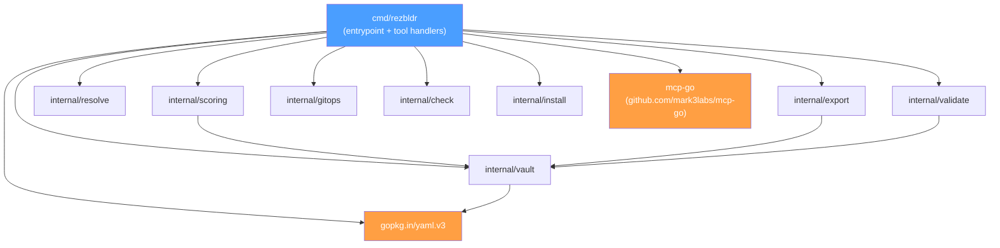
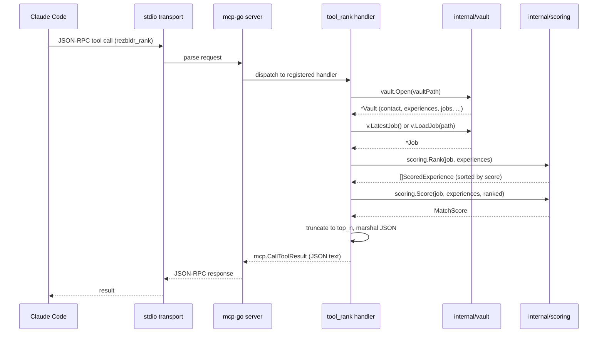
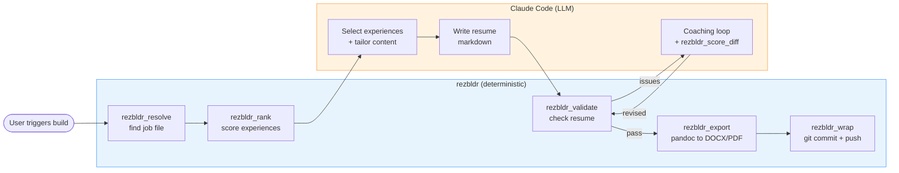

<!-- Copyright (c) 2026 John Suykerbuyk and SykeTech LTD -->
<!-- SPDX-License-Identifier: MIT OR Apache-2.0 -->

# Architecture

## 1. Overview

rezbldr is a Go MCP (Model Context Protocol) server that offloads
deterministic operations from the ResumeCTL Claude Code resume pipeline into
local, testable code. The core insight is that LLMs are expensive and
unreliable for tasks like tag-intersection scoring, file path resolution,
word-count validation, and document export. These operations have well-defined
inputs and outputs, making them ideal candidates for conventional code.

The design follows a clear separation of concerns: the LLM orchestrates the
resume-building workflow, deciding what to write and how to tailor content,
while rezbldr handles the computational grunt work. Claude Code calls rezbldr
tools over MCP's stdio transport to rank experience files against job postings,
resolve vault file paths, validate generated resumes, export to DOCX/PDF, and
commit results to git.

rezbldr reads from an Obsidian vault (the "RezBldrVault") containing
markdown files with YAML frontmatter. It loads the entire vault into memory on
each tool call, providing fast access to all profile, experience, job, resume,
and training data. The server is stateless between calls -- each invocation
re-reads the vault to pick up any changes made by the LLM between calls.

## 2. Package Dependency Diagram

**Notes on the dependency graph:**

- `internal/scoring` imports `internal/vault` for the `Job`, `Experience`,
  and `ExtractYear` types.
- `internal/export` imports `internal/vault` only for the `Strip` function
  (frontmatter removal before pandoc conversion).
- `internal/validate` imports `internal/vault` for the `Vault`, `SkillEntry`,
  `Experience`, and `Contact` types used in cross-referencing.
- `internal/resolve`, `internal/gitops`, `internal/check`, and
  `internal/install` have no internal dependencies -- they use only the
  standard library.
- `cmd/rezbldr` imports `mcp-go` for server setup and tool registration, and
  `yaml.v3` directly in `tool_frontmatter.go` for ad-hoc YAML unmarshalling.

## 3. MCP Request Flow

The following diagram shows how a `rezbldr_rank` tool call flows through the
system, from Claude Code to the JSON response.

## 4. End-to-End Resume Build Flow

This diagram shows the full resume pipeline. Steps handled by rezbldr are
marked distinctly from steps handled by the LLM.

## 5. Package Reference

### cmd/rezbldr

**Purpose:** MCP server entrypoint, subcommand router, and tool handler
registration.

- `main()` -- Subcommand dispatch: serve, version, check, install, uninstall
- `cmdServe()` -- Configures vault path, creates `mcp-go` server, registers
  all seven tools, starts stdio transport
- `Config` -- Runtime configuration struct holding `VaultPath`
- `registerRankTool()` -- Registers `rezbldr_rank` (scoring)
- `registerExportTool()` -- Registers `rezbldr_export` (pandoc conversion)
- `registerResolveTool()` -- Registers `rezbldr_resolve` (path resolution)
- `registerFrontmatterTool()` -- Registers `rezbldr_frontmatter` (YAML
  parse/strip/generate)
- `registerScoreDiffTool()` -- Registers `rezbldr_score_diff` (coaching delta)
- `registerValidateTool()` -- Registers `rezbldr_validate` (resume checks)
- `registerWrapTool()` -- Registers `rezbldr_wrap` (git operations)

**Depends on:** all `internal/*` packages, `mcp-go`, `yaml.v3`

### internal/vault

**Purpose:** Data access layer for the rezbldr Obsidian vault. Reads
markdown files with YAML frontmatter, parses them into typed structs, and
provides query methods.

- `Vault` -- Root struct holding all loaded vault data (Contact, Skills,
  Experiences, Jobs, Resumes, CoverLetters, Training)
- `Open(root)` -- Eagerly loads the entire vault into memory
- `LatestJob()`, `LatestResume()` -- Most recent by filename sort
- `LoadJob(path)` -- Load a single job file
- `Parse()`, `Strip()`, `Generate()` -- Frontmatter operations
- `Contact`, `Experience`, `Job`, `Resume`, `CoverLetter`, `Training` --
  Typed structs mapping to vault file schemas
- `SkillEntry` -- Row from the pipe-delimited skills table
- `Compensation` -- Normalized compensation from three YAML formats
- `ExtractYear()` -- Flexible date string parsing

**Depends on:** `yaml.v3`

### internal/scoring

**Purpose:** Tag-intersection scoring engine that ranks experience files
against job postings.

- `Rank(job, experiences)` -- Scores and sorts experiences by relevance
- `RankAt(job, experiences, year)` -- Testable variant with explicit year
- `Score(job, experiences, ranked)` -- Computes overall match score with
  coverage, domain, and seniority components
- `Diff(job, experiences, prevRanked, prevScore)` -- Computes score delta
  after vault edits
- `ScoredExperience` -- Per-experience result with matched skills and
  boost/penalty flags
- `MatchScore` -- Overall match with required/preferred coverage, domain
  match, seniority match
- `ScoreDiff` -- Before/after comparison for coaching loops
- `Cache` -- Thread-safe cache keyed by job path and experience mtime

**Weights:** required=2.0, preferred=1.0, tag=0.5, highlight boost=+10%,
age penalty=-30% (experiences ended >10 years ago)

**Depends on:** `internal/vault`

### internal/export

**Purpose:** Pandoc-based export pipeline for converting markdown to DOCX or
PDF.

- `Export(req)` -- Strips frontmatter, writes temp file, runs pandoc
- `OutputPath(source, format, outDir)` -- Computes output filename
- `FindMatchingCoverLetter(vaultRoot, resumePath)` -- Finds cover letter
  matching a resume by date and company slug prefix
- `Request` -- Export parameters (source, format, template, outDir)
- `Result` -- Export output (path, size, format)

**Depends on:** `internal/vault` (for `Strip`), `pandoc` (external binary)

### internal/resolve

**Purpose:** File path resolution and naming convention helpers for vault
files.

- `Latest(vaultRoot, ft)` -- Finds most recent file of a given type
- `Generate(vaultRoot, ft, slug, date, candidate)` -- Constructs a filename
  following vault naming conventions
- `Exists(vaultRoot, ft, slug, date)` -- Checks for file existence with
  alternative suggestions
- `ParseFileType(s)` -- Converts string to `FileType` enum
- `FileType` -- Enum: job, resume, cover, experience

**Depends on:** standard library only

### internal/validate

**Purpose:** Resume validation rules that cross-reference generated content
against vault data.

- `Resume(body, vault)` -- Runs all validation checks
- `Result` -- Validation outcome: word count, heading errors, unknown
  skills/companies, contact match, warnings

**Checks performed:**
- Word count within 600-800 range
- Heading hierarchy (no skipped levels, exactly one h1)
- Skills listed under "Core Competencies" exist in vault skills inventory
- Company names under h3 headings exist in vault experience records
- Contact info (email, phone) appears in the body

**Depends on:** `internal/vault`

### internal/gitops

**Purpose:** Git stage, commit, and push operations for wrapping up vault
changes.

- `Wrap(req)` -- Stages files, commits with message, discovers all remotes,
  pushes to each
- `WrapRequest` -- Input: repo dir, commit message, file list
- `WrapResult` -- Output: committed flag, hash, per-remote push results
- `PushResult` -- Per-remote push outcome

**Depends on:** standard library only, `git` (external binary)

### internal/check

**Purpose:** Environment and vault health checks for the `check` subcommand.

- `Run(vaultPath)` -- Runs all checks, returns results
- `Result` -- Check outcome: name, status (ok/warn/fail), detail

**Checks performed:** Go runtime, pandoc availability, git availability,
vault path existence, vault directory structure (profile, jobs/target,
resumes), contact.md presence, Claude Code MCP settings registration.

**Depends on:** standard library only

### internal/install

**Purpose:** Registration and removal of the rezbldr MCP server in Claude
Code settings files.

- `Install(binaryPath, settingsDir, vaultPath)` -- Adds/updates rezbldr
  stanza in `settings.local.json`
- `Uninstall(settingsDir)` -- Removes rezbldr stanza from settings

**Depends on:** standard library only

## 6. Data Model

rezbldr reads from an Obsidian vault organized into directories by content
type. Each markdown file uses YAML frontmatter for structured metadata and
a markdown body for human-readable content.

**Key types:**

| Type | Vault path | Key fields |
|------|-----------|------------|
| `Contact` | `profile/contact.md` | name, email, phone, location, linkedin, github |
| `SkillEntry` | `profile/skills.md` | skill, proficiency, last_used, years, category |
| `Experience` | `experience/*.md` | role, company, start, end, tags, skills, domain, highlight |
| `Job` | `jobs/target/*.md` | title, company, required_skills, preferred_skills, compensation |
| `Resume` | `resumes/generated/*.md` | job_file, model, status, experience_files, word_count |
| `CoverLetter` | `cover-letters/*.md` | job_file, resume_file, model, status |
| `Training` | `training/*.md` | skill, category, priority, status, surfaced_by |

Job compensation is normalized from three YAML formats: structured object
(`min`/`max`/`currency`/`equity`), salary string (`"$200,000 - $280,000
USD"`), or salary_range string. Source URLs are similarly normalized from
`source`, `source_url`, or `url` fields.

For full YAML frontmatter schemas, see `doc/vault-schema.md`.

## 7. CLI Subcommands

| Subcommand | Description |
|-----------|-------------|
| `serve` | Start the MCP server on stdio (default when no subcommand given) |
| `version` | Print version, commit hash, and build date (injected via ldflags) |
| `check` | Validate environment and vault: Go, pandoc, git, vault structure, Claude settings |
| `install` | Register rezbldr in Claude Code `~/.claude/settings.local.json` |
| `uninstall` | Remove rezbldr from Claude Code settings |

If the first argument looks like a flag (starts with `-`), it is treated as
arguments to `serve`.

## 8. Configuration

rezbldr requires a single configuration value: the path to the rezbldr
vault. It is resolved in this order:

1. `--vault` flag (e.g., `rezbldr serve --vault /path/to/vault`)
2. `REZBLDR_VAULT` environment variable
3. Default: `~/obsidian/RezBldrVault`

The vault path is validated at startup by checking for `profile/contact.md`.

**Claude Code integration:** Run `rezbldr install` to register the server in
`~/.claude/settings.local.json`. This writes an `mcpServers.rezbldr` stanza
with the binary path and `--vault` argument. Claude Code then launches rezbldr
as a child process, communicating over stdin/stdout using the MCP JSON-RPC
protocol. The `rezbldr check` command verifies that this registration is in
place.

**Build-time configuration:** Version, commit, and date are injected via Go
ldflags (see `Makefile`).
