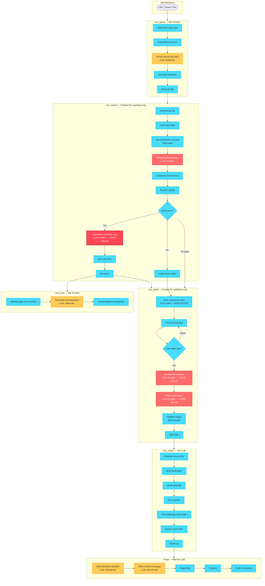
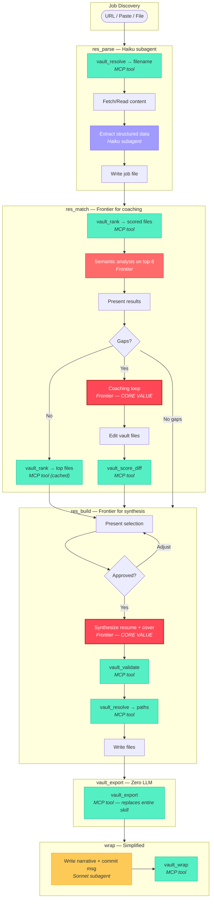
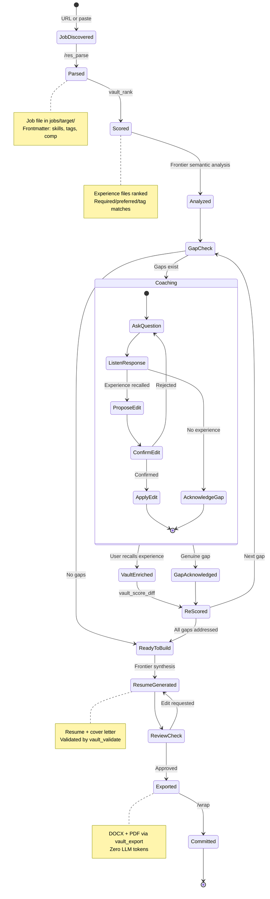
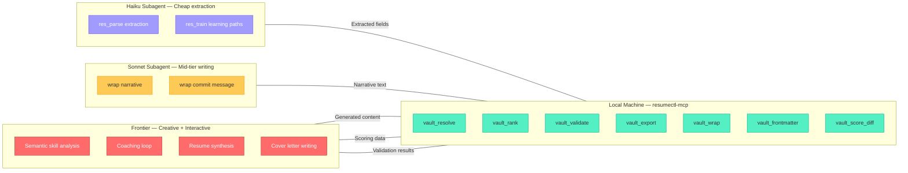

# ResumeCTL Workflow Optimization Analysis

**Date:** 2026-04-04
**Scope:** Retrospective analysis of 21 commits, 50 sessions, 6 Claude Code
skills across a 3-day sprint producing 15+ targeted applications.

---

## Part 1: Intelligence Classification

Every step across all 6 skills classified by what level of compute
actually does the work.

### Legend

- **F** = Frontier LLM required (creative synthesis, judgment, conversation)
- **M** = Mid-tier LLM sufficient (extraction, summarization — Haiku/Sonnet)
- **C** = Pure code (deterministic logic, shell commands, math)

### `/res_parse` — Parse Job Posting

| Step | Description | Level | Notes |
|------|-------------|-------|-------|
| 1a | Determine input type (URL/file/paste) | C | String pattern match |
| 1b | Fetch URL content | C | WebFetch call |
| 2 | Extract structured fields from posting | M | Structured extraction, not creative |
| 3 | Generate filename | C | Date + slug formatting |
| 4 | Compose file with frontmatter + sections | M | Template fill with light rewriting |
| 5 | Confirm and write | C | File I/O |

**Verdict:** 0% Frontier. Haiku-tier extraction + local code for file ops.

### `/res_match` — Gap Analysis + Coaching

| Step | Description | Level | Notes |
|------|-------------|-------|-------|
| 1 | Resolve job file (glob + sort) | C | Most-recent-file lookup |
| 2 | Load vault data (read all files) | C | File I/O + frontmatter parse |
| 3 | Tag intersection scoring | C | Weighted set intersection math |
| 4 | Semantic skill-by-skill analysis | F | Requires understanding nuance |
| 5 | Compute overall score | C | Weighted formula |
| 6 | Present results | C | Template formatting |
| 7 | Interactive coaching loop | **F** | **Core value** — surfaces undocumented experience |

**Verdict:** Steps 1-3, 5-6 are pure code. Steps 4 and 7 require Frontier.
The coaching loop is the single highest-value use of the frontier model in
the entire pipeline.

### `/res_build` — Generate Resume + Cover Letter

| Step | Description | Level | Notes |
|------|-------------|-------|-------|
| 1 | Load source data | C | File I/O |
| 2 | Tag intersection scoring + ranking | C | **Duplicated** from /res_match |
| 3 | Present selection for approval | C | Template formatting |
| 4 | Synthesize professional summary | **F** | Creative, job-specific writing |
| 5 | Select and order core competencies | F | Judgment call on relevance |
| 6 | Rewrite experience bullets | **F** | **Core value** — tailored narrative |
| 7 | Cover letter | **F** | **Core value** — hooks, narrative, voice |
| 8 | Compose frontmatter | C | Template fill |
| 9 | Validate (word count, headings, skills) | C | Rules-based checking |
| 10 | Write file | C | File I/O |

**Verdict:** Steps 4-7 are genuine Frontier work. Everything else is code.

### `/res_export` — Export to DOCX/PDF

| Step | Description | Level | Notes |
|------|-------------|-------|-------|
| 1 | Resolve resume file | C | Glob + sort |
| 2 | Strip frontmatter | C | YAML delimiter detection |
| 3 | Verify heading hierarchy | C | Regex check |
| 4 | Write temp file | C | File I/O |
| 5 | Check pandoc availability | C | `which pandoc` |
| 6 | Determine output path | C | String formatting |
| 7 | Run pandoc | C | Shell command |
| 8 | Find matching cover letter | C | Glob pattern |
| 9 | Export cover letter | C | Same as 2-7 |
| 10 | Clean up temp files | C | Shell command |

**Verdict: 0% LLM of any kind.** This is a shell script masquerading as a
frontier model prompt. ~10K tokens per invocation, entirely wasted.

### `/res_train` — Training File Generation

| Step | Description | Level | Notes |
|------|-------------|-------|-------|
| 1 | Resolve job file | C | Glob + sort |
| 2 | Load vault data | C | File I/O |
| 3 | Identify gaps (skills cross-ref) | C | Set difference against skills.md |
| 4 | Generate learning paths | M | Templated but needs some creativity |
| 5 | Update existing training files | C | Frontmatter merge + table append |
| 6 | Present summary | C | Template formatting |

**Verdict:** Mostly code. Learning path generation is the only LLM step,
and Haiku/Sonnet handles it fine.

### `/wrap` — Commit Vault Changes

| Step | Description | Level | Notes |
|------|-------------|-------|-------|
| 1 | Update resume.md | M | Summary writing |
| 2 | Append iterations.md | M | Narrative writing |
| 3 | Update commit.msg | M | Structured description |
| 4 | Stage files | C | `git add` |
| 5 | Commit | C | `git commit -F` |
| 6 | Discover remotes | C | `git remote` |
| 7 | Push to remotes | C | `git push` |

**Verdict:** Steps 1-3 need a mid-tier model. Steps 4-7 are shell commands.

---

## Summary: Token Waste by Skill

| Skill | Total Steps | Code Steps | LLM Steps | Frontier Steps | Waste |
|-------|-------------|------------|-----------|----------------|-------|
| /res_parse | 5 | 3 | 2 (M) | 0 | **100%** frontier waste |
| /res_match | 7 | 5 | 0 | 2 | 71% code, well-targeted LLM |
| /res_build | 10 | 6 | 0 | 4 | 60% code, well-targeted LLM |
| /res_export | 10 | 10 | 0 | 0 | **100%** total waste |
| /res_train | 6 | 5 | 1 (M) | 0 | **100%** frontier waste |
| /wrap | 7 | 4 | 3 (M) | 0 | **100%** frontier waste |

### Duplicated Logic

The tag intersection scoring algorithm appears in both `/res_match` (Step 3)
and `/res_build` (Step 2) with identical weights (required=2.0, preferred=1.0,
tag=0.5) and modifiers (highlight +10%, age -30%). This is ~30 lines of
prompt repeated twice, consuming tokens in both invocations for the same math.

### The "Most Recent File" Pattern

Four of six skills (res_match, res_build, res_train, res_export) begin with
identical "resolve the file" logic: glob a directory, sort by name, pick the
newest. This is a one-line shell command repeated four times across prompts.

---

## Part 2: Local Code Offload Architecture

### Proposed: `resumectl-mcp` — A lightweight MCP server

Written in Go (matching John's strongest systems language), this server
replaces all deterministic operations with local tools. The frontier model
only fires for creative synthesis and interactive coaching.

### Tool Definitions

#### `vault_rank` — Experience File Scoring
```
Input:  job_file path (or "latest")
Output: JSON array of {file, role, company, score, matched_required[],
        matched_preferred[], matched_tags[]} sorted by score descending
```
Implements the tag intersection algorithm once, correctly, testably.
Eliminates the duplicated scoring logic from /res_match and /res_build.
Pre-loads and caches frontmatter from experience files.

#### `vault_resolve` — File Path Resolution
```
Input:  type ("job"|"resume"|"cover"), slug (optional), date (optional)
Output: {path, exists, alternatives[]}
```
Handles the "most recent file in directory" pattern, naming convention
generation, version numbering, and directory creation. One tool replaces
the file resolution preamble from 4 different skills.

#### `vault_validate` — Resume Validation
```
Input:  resume_path
Output: {word_count, heading_errors[], unknown_skills[], missing_companies[],
         contact_match: bool, warnings[]}
```
Checks all /res_build validation rules: word count 600-800, heading
hierarchy (h1/h2/h3), skills against skills.md, companies against
experience files, contact info against contact.md. Returns structured
results so the LLM can fix issues without re-reading source files.

#### `vault_export` — Pandoc Export Pipeline
```
Input:  source_path, format ("docx"|"pdf"), template (optional)
Output: {resume_path, resume_size, cover_path, cover_size, errors[]}
```
**Replaces /res_export entirely.** Strips frontmatter, writes temp file,
runs pandoc, auto-discovers matching cover letter, exports both, cleans up.
Zero LLM involvement. Could be invoked directly by the user or by other
tools.

#### `vault_frontmatter` — YAML Frontmatter Parser
```
Input:  file_path, action ("parse"|"generate"|"strip")
Output: JSON object of frontmatter fields, or cleaned markdown body
```
The LLM currently spends tokens on "parse frontmatter" instructions in
every skill. This extracts it once as structured JSON.

#### `vault_wrap` — Git Operations
```
Input:  commit_message, files[] (explicit paths)
Output: {committed: bool, hash, push_results: [{remote, success, error}]}
```
Stages specified files, commits with message, discovers and pushes to all
remotes. Replaces the git portion of /wrap. The LLM still writes the
commit message and narrative — this tool just executes.

#### `vault_score_diff` — Before/After Scoring
```
Input:  job_file, changes[] (file edits made during coaching)
Output: {old_score, new_score, delta, improved_skills[]}
```
Used during the coaching loop to show score improvement after vault edits,
without the LLM re-computing the math.

### What the Skills Become

After offloading to `resumectl-mcp`:

#### `/res_parse` (Simplified)
1. Determine input type → fetch/read content
2. **LLM (Haiku subagent):** Extract structured fields from raw text
3. `vault_resolve` → generate filename
4. Write file

**Token reduction:** ~60% (Haiku + no file resolution logic in prompt)

#### `/res_match` (Streamlined)
1. `vault_resolve` → find job file
2. `vault_rank` → pre-computed scores + matched skills
3. **LLM (Frontier):** Semantic analysis on top-8 files only
4. **LLM (Frontier):** Interactive coaching loop
5. `vault_score_diff` → show improvement after edits

**Token reduction:** ~40% (no scoring logic in prompt, skip bottom files)

#### `/res_build` (Streamlined)
1. `vault_resolve` → find job file
2. `vault_rank` → pre-ranked experience files
3. **LLM (Frontier):** Synthesize resume + cover letter
4. `vault_validate` → check output
5. `vault_resolve` → generate output path
6. Write files

**Token reduction:** ~35% (no scoring, no validation logic in prompt)

#### `/res_export` → **DELETED**
Replaced entirely by `vault_export`. User calls it directly:
```
vault_export resumes/generated/john_suykerbuyk_2026-04-04-micron_resume.md
```
Or /res_build calls it automatically after writing.

**Token reduction:** 100%

#### `/res_train` (Simplified)
1. `vault_resolve` → find job file
2. `vault_rank` → identify gaps (skills not in matched sets)
3. **LLM (Haiku subagent):** Generate learning paths for gaps
4. Write/update training files

**Token reduction:** ~50%

#### `/wrap` (Simplified)
1. **LLM (mid-tier):** Write iteration narrative + commit message
2. `vault_wrap` → stage, commit, push

**Token reduction:** ~40%

### Estimated Token Savings Per Application Cycle

| Skill | Current | Optimized | Savings |
|-------|---------|-----------|---------|
| /res_parse | ~15K | ~6K (Haiku) | 60% |
| /res_match | ~40K | ~24K | 40% |
| /res_build | ~30K | ~20K | 33% |
| /res_export | ~10K | 0 | **100%** |
| /res_train | ~8K | ~4K (Haiku) | 50% |
| /wrap | ~15K | ~9K | 40% |
| **Total** | **~118K** | **~63K** | **~47%** |

Frontier tokens specifically drop from ~118K to ~44K (the res_match and
res_build creative work). The remaining ~19K shifts to Haiku, which is
~25x cheaper per token.

### Implementation Priority

1. **`vault_export`** — Immediate, highest ROI. Zero LLM involvement,
   replaces an entire skill, simple to implement and test.
2. **`vault_rank`** — High ROI. Eliminates duplicated logic, reduces
   context loading in the two most token-heavy skills.
3. **`vault_resolve`** — Medium ROI. Small per-invocation savings but
   used in every skill.
4. **`vault_validate`** — Medium ROI. Catches errors without LLM
   re-reading source files.
5. **`vault_wrap`** — Lower ROI but removes git operation prompting.
6. **`vault_frontmatter`** — Nice-to-have. Reduces prompt complexity.
7. **`vault_score_diff`** — Nice-to-have. Coaching loop quality-of-life.

### Tech Stack Recommendation

- **Language:** Go — John's strongest systems language, excellent for
  MCP servers (fast startup, single binary, good YAML/JSON libraries)
- **MCP framework:** `github.com/mark3labs/mcp-go` or similar
- **YAML parsing:** `gopkg.in/yaml.v3` for frontmatter
- **Testing:** Standard Go testing + golden files for scoring algorithm
- **Distribution:** Single binary, no runtime dependencies

---

## Part 3: Workflow Diagrams

### Current Workflow — Full Pipeline



### Proposed Optimized Workflow — With `resumectl-mcp`



### State Diagram — Single Job Application Lifecycle



### Execution Model — What Runs Where



---

## Part 4: Observations and Recommendations

### What's Already Working Well

1. **The coaching loop is genuinely valuable.** Sessions show score jumps
   of 10-20 points (62→79 for Sony DevOps, 86→91 for FarmGPU) from
   surfacing undocumented experience. This is the correct use of a frontier
   model — interactive judgment that requires understanding context.

2. **The vault enrichment pattern compounds.** Early sessions enrich
   experience files, and later sessions benefit ("No vault enrichment
   needed — reused context from iteration 18"). The vault is getting
   richer over time.

3. **Naming conventions stabilized by day 2.** The `{name}_{date}-{slug}`
   pattern locked in after one correction cycle. No regressions since.

4. **Honest gap assessment.** Sessions correctly rejected poor fits
   (PNC at 52, RIVA at 44) and honestly acknowledged genuine gaps
   (Kubernetes, Terraform, Weka). This is working as designed.

### What Should Change

1. **Kill /res_export immediately.** It is a 153-line prompt that
   instructs a frontier model to run `pandoc`. This is the single most
   wasteful construct in the pipeline. Replace with a 50-line Go function.

2. **Unify the scoring algorithm.** Tag intersection scoring is
   duplicated verbatim between /res_match and /res_build. Extract it
   once, test it, and serve results via MCP. This also enables caching —
   if /res_match already scored for a job, /res_build shouldn't re-score.

3. **Stop loading all 15 experience files into context for every skill.**
   After vault_rank pre-scores, the LLM only needs to read the top 5-8
   files plus the gap-specific files. This alone saves ~15K tokens per
   invocation in /res_match and /res_build.

4. **Shift /res_parse to Haiku.** Structured extraction from job postings
   is well within Haiku's capabilities. The current prompts don't require
   creative judgment — they require careful reading and field extraction.

5. **Consider auto-chaining.** The most common flow is parse → match →
   build → export → wrap. Each skill currently requires manual invocation.
   A single `/res_pipeline <url>` command could orchestrate the full chain
   with human checkpoints only at coaching (interactive) and resume review
   (approval gate).

### The Mermaid-as-Specification Experiment

The state diagram above is deliberately precise enough to be machine-
readable. The key insight: each state transition maps to either an MCP
tool call (deterministic) or an LLM invocation (creative), with the
transition type explicitly labeled. A code generator given this diagram
plus the tool signatures could produce:

- The MCP server scaffold (Go struct definitions, handler stubs)
- The simplified skill prompts (only the LLM-required states)
- Integration tests (state transition coverage)
- A CLI orchestrator (the pipeline command)

This is the "well-defined Mermaid diagram → optimized workflow" hypothesis.
The diagram encodes not just *what* happens but *where* each operation
should execute and *why* — which is the information a code generator needs
to make correct architectural decisions rather than just syntactic ones.
